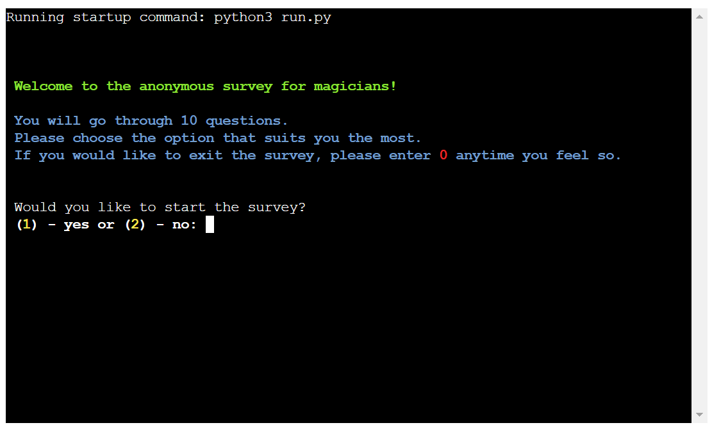
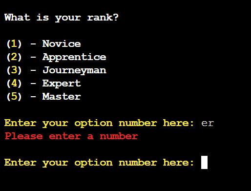
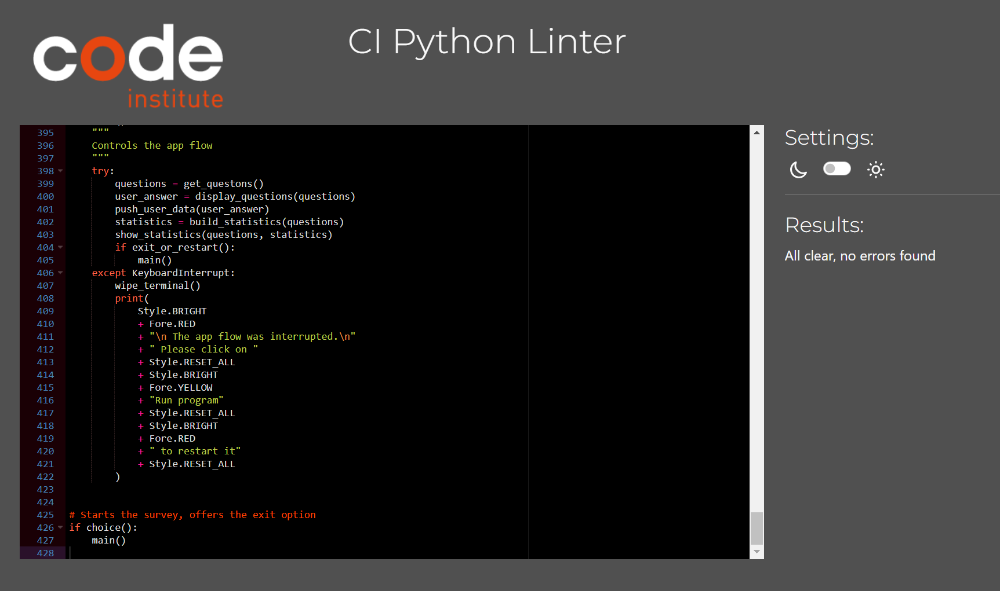

# Python Command-Line Application - Magicians' Survey

## Introduction

This application is a tool to do a survey. It uses Google Sheets to save the results so that the information can be processed further. The app also shows the overall result in percents. The worksheet called "questions" can include any amount of questions and each question can include any number of answer options. The app will display them to the user and collect the answers, then transfer them to the worksheet called "data".

[Live link to the app](https://magicians-survey-ead8dc1fb246.herokuapp.com/)

## Table of Contents

* [Introduction](#introduction)

* [User Experience](#user-experience)
  * [User Stories](#user-stories)

* [Design](#design)
  * [Color Scheme](#color-scheme)
  * [Flowchart](#flowchart)

* [Features](#features)
  * [Technical Features](#technical-features)

* [Technologies Used](#technologies-used)
  * [Languages Used](#languages-used)
  * [Modules & Libraries Used](#modules--libraries-used)
  * [Programs Used](#programs-used)

* [Deployment](#deployment)
  * [Version Control](#version-control)
  * [Heroku deployment](#heroku-deployment)

* [Testing](#testing)
  * [Validator Testing](#validator-testing)
  * [Manual Testing](#manual-testing)
  * [Known And Unfixed Bugs](#known-and-unfixed-bugs)
  * [Future Improvements](#future-improvements)

* [Credits](#credits)
  * [Acknowledgments](#acknowledgments)
  * [Tutorials & Content](#tutorials--content)

* [Misc.](#misc)
  * [Questions used](#questions-used)

## User Experience

Users can do the survey and answer 10 questions. The information can be analyzed further. The overall results are calculated by the program and shown after the survey is completed by the user.

### User Stories

- As a user, I would like to be able to exit the application at any stage, so I am not trapped in a lengthy process that I can not stop.
- As a user, I would like to answer each question one by one, so I can concentrate on one thing at a time.

## Design

### Color Scheme

- The instructions for the survey are highlited in blue.

- The warning about wrong input is highlighted in red.

- The answer options are highlighted in yellow.

- The tables are coloured in magenta and green.

### Flowchart

## Features

- Terminal is cleared with every screen to keep a good overview and good user experience.
- The survey can be conducted by anyone.
- Everyone doing a survey can see the overall results afterwords.
- Validation for every input.

### Technical Features

- The questions are loaded from gspread sheet for every new survey.
- The answers are transferred to the gspread sheet.
- The overall result counted in percents after each new survey completion.

## Technologies Used

### Languages Used

- Python

### Modules & libraries used

**Google-Auth**
- Google-Auth helps with the authentication to use the Google API.

**gspread**
- gspread is needed for accessing and updating data in a Google spread sheet

**colorama**
- colorama helps with coloring the text.

**rich**
- rich helps to display statistics in tables

**Misc.**
- os - for terminal wipe
- sys - Import sys for restart of app
- time - Import time for sleep feature, get date and time to record user answers

### Programs Used

During the development of this application, the following programs have been used.

- Draw.io/diagrams.net
- Heroku
- Git
- GitHub
- GitPod
- Google Spreadsheet
- CI Python Linter

## Deployment

### Version Control

Git was used for version control by utilizing the Gitpod terminal to commit to Git and Push to GitHub:

- git add . - Upload and update the files to the GitHub repository.
- git commit -m "commit message" - Commenting the commit to better understand the changes in this specific commit.
- git push - Upload the commit to GitHub.

### Heroku Deployment

[The deployed application can be found here](https://magicians-survey-ead8dc1fb246.herokuapp.com/)

**Step 0: Create requirements.txt**
- Create the requirements.txt
- Make sure it contains all needed modules and libraries.

**Step 1: Use Account**
- Create a Heroku account
- Log into the Heroku account

**Step 2: Create New App**
- On the dashboard, click "New" in the upper right corner.
- Select "Create new app"
- Select a name for the application - the name should only contain lowercase letters, numbers, and dashes.
- Choose a region. (Europe as we are in Europe)

**Step 3: Define Deployment Methode**
- Select GitHub as deployment methode
- Connect GitHub account to Heroku
- Select account and search for repository
- Connect to found repository

**Step 4: Settings**
- Switch to the settings page (Menu in the top)
- Click on "Reveal Config Vars"
- Add one with the key "CREDS" and as value the content of the file creds.json from IDE.
- Add one with the key "PORT" and value of "8000"
- In the next section, click on "Add buildpack"
- If not already selected, add Python.
- Add nodejs next.

**Step 5: Deploy Application**
- Switch to the deploy page (Menu in the top)
- Look under manual deployment
- Select a branch to deploy (Main in my case)
- Click "Deploy Branche"

**Step 6: Use App**
- Heroku will then set up the virtual envirement with all modules and libraries needed. (This can take some time)
- When Heroku is done with the deployment, click "View" and start the
- Use app

## Testing
### Validator Testing

The code validation with the Code Institute Python Linter shows no errors

### Manual Testing

| **Test** | **Description** | **Expected Outcome** | **Result** |
| --- | --- | --- | --- |
| **Welcome Screen** |  |  |  |
| --- | --- | --- | --- |
| Select "yes" to start the survey | Enter "1" and press enter | Accept input and load the first question of the survey | Pass |
| Select "no" | Enter "2" and press enter | Accept the input, close the app | Pass |
| Choose to exit | Enter "0" and press enter | Accept the input, close the app | Pass |
| Enter not shown option (int) | Enter an integer that is not shown and press enter | Show error message for wrong input | Pass |
| Enter not shown option (str) | Enter a string that is not shown and press enter | Show error message for wrong input | Pass |
| Enter not shown option (empty space) | Not enter anything and press enter | Show error message for wrong input | Pass |
| Enter not shown option (Ctrl + C) | Enter Ctrl + C | Show error message for wrong input | Pass |
| --- | --- | --- | --- |
| **Conducting Survey** |  |  |  |
| --- | --- | --- | --- |
| Select available answer option (around 1-12, depends on the question) | Enter "1" and press enter | Load next question/screen | Pass |
| Enter value grater than 12 (or one more the maximum available option) | Enter a value that is greater than answer options | Show error message for wrong input | Pass |
| Enter incorrect | Enter a value that is no int (str, spaced, symbols) | Show error message for wrong input | Pass |
| Exit application | Enter "0" and press enter | Close app | Pass |
| Complete survey | Answer all questions with valid input | Load thank you screen, then load statistics | Pass |
| Complete survey data upload | Answer all questions with valide input | Upload data as a new row to gspread with current date and UTC time | Pass |
| --- | --- | --- | --- |
| **Showing statistics** |  |  |  |
| --- | --- | --- | --- |
| Complete survey | Answer all questions with valid input | Load thank you screen, then load statistics | Pass |
| Look through statistics of the question (1-10) | Find all answer options of this question in the table | See precentage of each option compared to total number of people who completed the survey | Pass

### Known And Unfixed Bugs

- The InterruptKeyboard Exception in main function shows warning message and closes the app but does not restart it. It would be good to add the restart option or avoid closing the app at all.

### Future Improvements

- Restart option.
- Admin can use own questions/data sheet file to do the survey.
- Download results in a separate file to the user device.
- Improving the visual design with some ASCII art and other ways for better structuring.
- Upload overall percentage count to the separate worksheet for further use.
- More detailed algorithm for analysing the data.

## Credits
### Acknowledgments

- [Cohort Facilitator - Marko Tot](https://github.com/tmarkec) for support in the classroom and guidance through the course.
- [Portfolio Project 3 by Dennis Schenkel](https://github.com/DennisSchenkel/PP3) - Inspiration for the project. The code and README structure.

### Tutorials & Content  

  - [Code institute](https://learn.codeinstitute.net/) - The tutorials and walkthrough projects.
  - [GeeksforGeeks](https://www.geeksforgeeks.org/) - Python Tutorial.
  - [W3Schools](https://www.w3schools.com/python/default.asp) - Python Tutorial.
  - [Python 3.12.4 documentation](https://docs.python.org/3/index.html) - The official documentation for Python 3.12.4.

## Misc.

### Google Sheet File Structure

- #### Wroksheet "data"
It includes the first row of date, time and list of questions. The next rows are the users' answers. Any new survey should follow the same data structure for the app to work.

- #### Wroksheet "questions"
It contains the survey questions and answer options. Any new survey should follow the same data structure for the app to work.

### Questions Used

The following questions have been used in the survey:

1. What is your rank?
   - Novice
   - Apprentice
   - Journeyman
   - Expert
   - Master
2. What is your magic source?
   - Water
   - Fire
   - Flora
   - Wind
   - Sunshine
   - Lightning
   - Sound
   - Earth
   - Craft
   - Moon
   - Shadow
   - Fauna
3. Which kind of potions do you use the most?
    - Plant growth potion
    - Light potion
    - Potion of transformation
    - Rain summoning potion
    - Night vision potion
    - Speed potion
    - Teleportation potion
    - Destruction potion
    - Restoration potion
    - Healing potion
    - Underwater breath potion
    - Levitation potion
4. What brand do you prefer?
    - Chamoth
    - Nature
    - Biofire
    - Orchrain
    - Lilight
    - Maggucci
    - Mc Ronald
    - Mr & Mrs Worm
5. What bottle size do you prefer?
    - 10 ml
    - 30 ml
    - 50 ml
    - 100 ml
    - 250 ml
6. How often do you buy this product?
    - Every day
    - Several times a week
    - Once a week
    - Twice a month
    - Several times a month
    - Once a month
    - Once in a season
    - Once a year
7. How much do you buy per purchase?
   - 1 - 5
   - 6 - 10
   - 11 - 20
   - 21 - 50
   - 50 - 100
   - 100 +
8. What is the most important for you when you buy the product?
   - Attractive pricing
   - Quality
   - Duration
   - Price to quality ratio
   - Discounts (e.g. 15%)
   - Bonus on purchase (e.g. 2 for 1 deal)
9. How do you prefer to shop?
   - Online shop
   - In store
   - By phone
10. What is your preferred payment method?
    - Debit/credit card
    - Cash
    - Direct debit
    - Cheque
    - Cash on delivery
    - Card on delivery